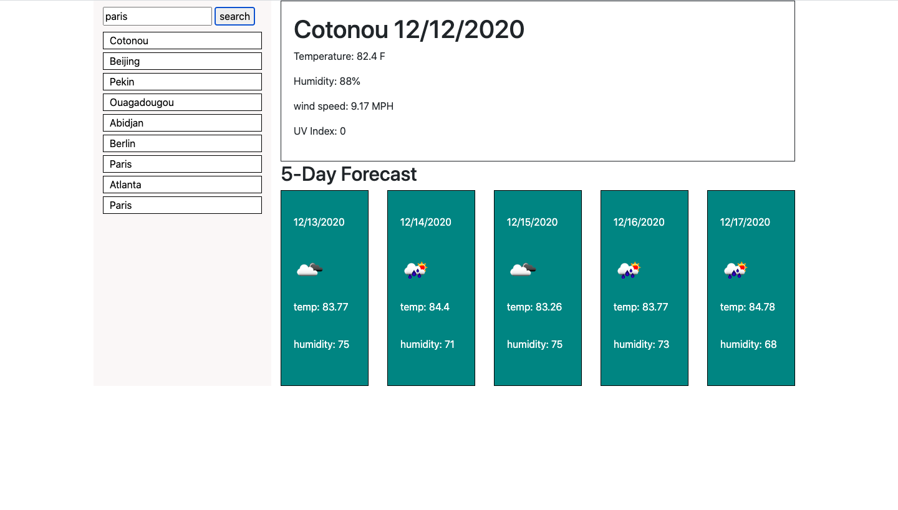

# Weather-App
this is an app that presents the weather depending on the city and show you the forecast for 5 consecutive days . 

the website also show you the condition of the weather by using explicit image.on this webisite you can see:
*the temperature 
*the wind speed 
*the UV index
*the humidity

## Technology Use 
* HTML
* CSS 
* JAVASCRIPT
* JQUERRY

# Images in README

